# GameScript

A cross-platform dialogue authoring system for games. GameScript provides a visual graph editor embedded in IDEs (VS Code, Rider), with runtime packages for Unity, Unreal, and Godot.

## What is GameScript?

GameScript is a complete dialogue middleware solution that lets game developers:

- **Design dialogue flows** using a visual node-based graph editor
- **Write game logic** in native code (C#, C++, GDScript) with full IDE support
- **Collaborate** using PostgreSQL for team projects or SQLite for solo development
- **Deploy** high-performance binary snapshots to game engines

Unlike traditional dialogue tools that use embedded scripting languages, GameScript keeps all game logic in native code files. Actions and conditions are regular functions that get full IDE support: autocomplete, debugging, refactoring, and type checking.

## Using the IDE Plugin

GameScript's interface is a web-based editor embedded in your IDE (VS Code or Rider). The UI uses a dockable panel system where you can arrange panels to suit your workflow.

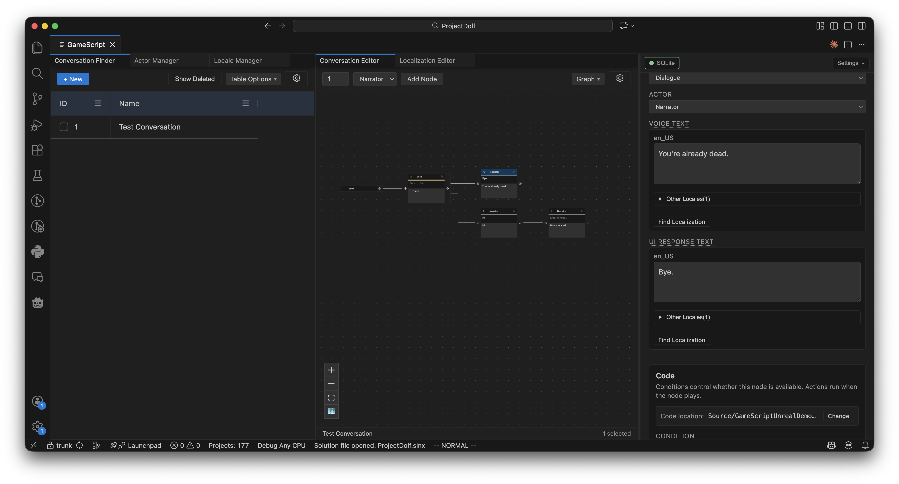

### Opening GameScript

Click the **GameScript icon** in the IDE sidebar (Activity Bar in VS Code, Tool Window in Rider) to open the editor panel.

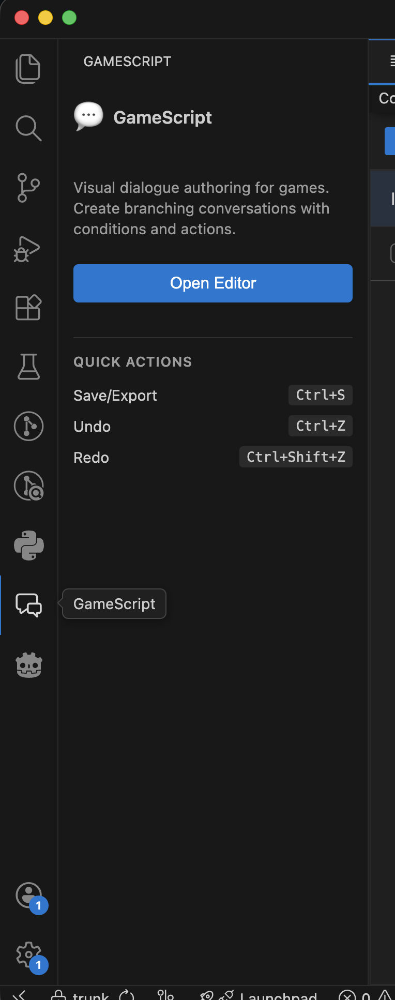

### Conversation Finder

The Conversation Finder is your central hub for managing dialogue conversations.

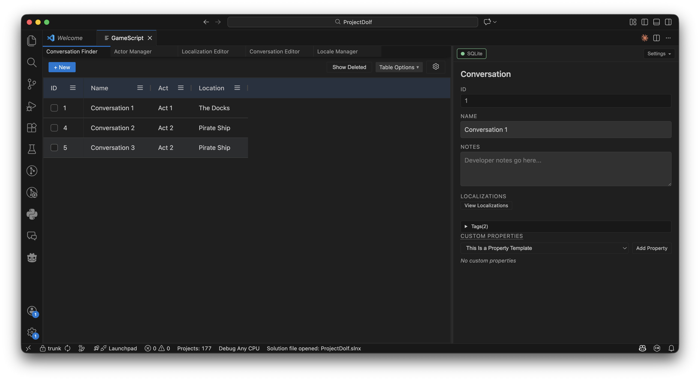

**Features:**
- **Search & Filter** – Filter conversations by name, ID, tags, or any column
- **Inline Editing** – Double-click cells to edit names directly in the grid
- **Multi-select** – Select multiple conversations for bulk delete/restore
- **Soft Delete** – Deleted conversations can be restored; toggle visibility with the "Show Deleted" button
- **Dynamic Tag Columns** – Custom tag categories appear as filterable columns

#### Tag Categories

Tag categories let you organize conversations with custom metadata. For example, create a "Status" category with values like "Draft", "In Review", and "Approved".

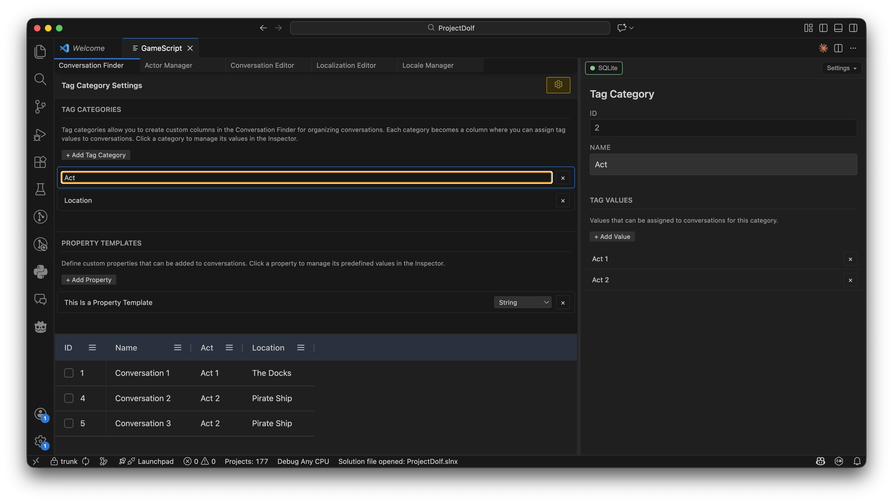

**To create a tag category:**
1. Click the **gear icon** in the Conversation Finder toolbar to open Tag Category Settings
2. Click **Add Category** and enter a name
3. Select the category in the Inspector to add values
4. A new column appears in the grid—assign values by editing cells

#### Property Templates

Property templates define custom data fields attached to conversations or nodes. Unlike tags (which are for organization), properties store game-relevant data that gets exported to your runtime.

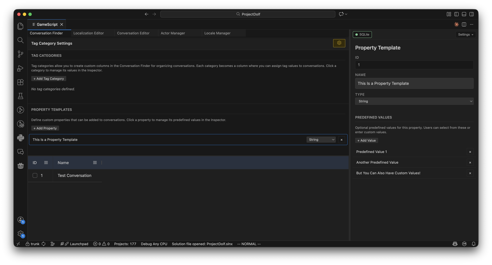

**Property types:**
- **String** – Text values
- **Integer** – Whole numbers
- **Decimal** – Floating-point numbers
- **Boolean** – True/false checkboxes

**To create a property template:**
1. Click the **properties icon** in the toolbar to open Property Template Settings
2. Click **Add Template** and choose a name and type
3. Optionally add **predefined values** (dropdown options) for non-boolean types
4. Properties appear in the Inspector when editing conversations or nodes

### Conversation Editor (Graph)

The Graph Editor is where you design dialogue flows using a visual node-and-edge interface.

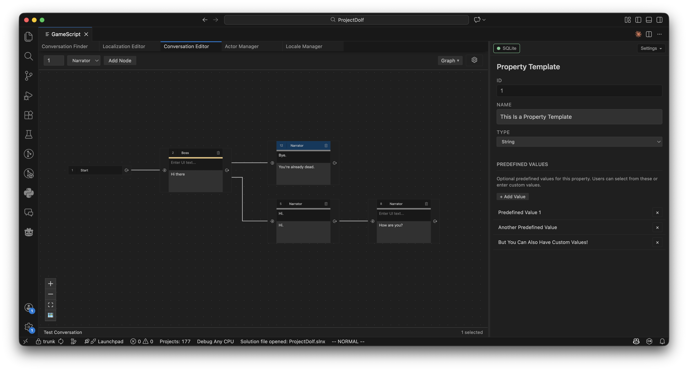

**Node types:**
- **Root Node** – The conversation entry point (auto-created, cannot be deleted)
- **Dialogue Node** – A line of dialogue spoken by an actor
- **Logic Node** – Runs conditions/actions without displaying text

**Working with nodes:**
- **Create** – Use the toolbar or right-click menu to add nodes
- **Connect** – Drag from an output port to an input port to create edges
- **Select** – Click nodes/edges or drag a selection box
- **Delete** – Press Delete or use the Graph menu
- **Copy/Paste** – Cmd/Ctrl+C and Cmd/Ctrl+V within the same conversation

**Layout options:**
- **Auto Layout** – Toggle automatic hierarchical arrangement (uses ELK layout engine)
- **Vertical/Horizontal** – Switch layout orientation via the Graph menu
- **Manual Mode** – Disable auto-layout to position nodes freely

**Edge properties:**
- **Priority** – Higher priority edges are evaluated first when multiple paths exist
- **Type** – "Default" (visible) or "Hidden" (internal flow, not shown to players)

### Actor Manager

Actors are the characters who speak dialogue lines.

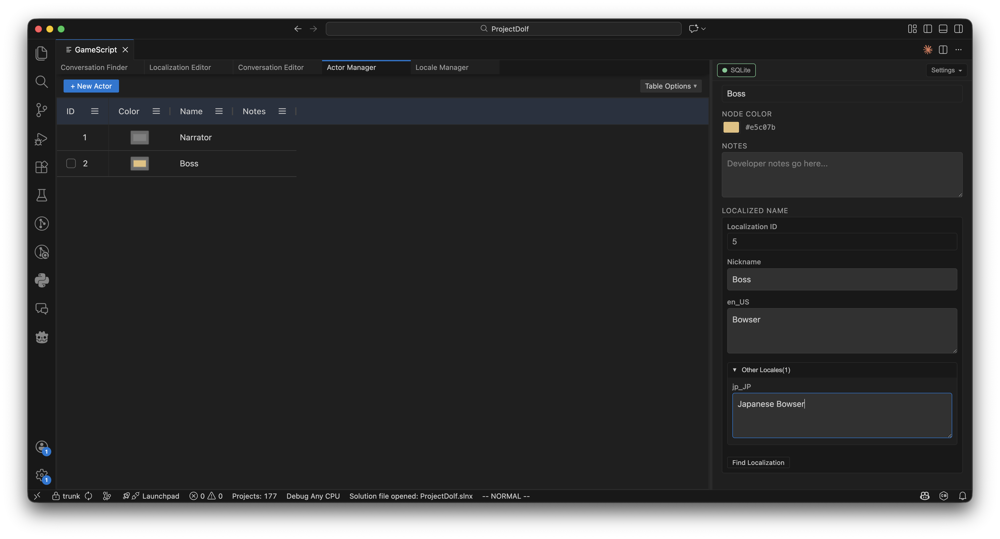

**Features:**
- **Create actors** with auto-assigned colors
- **Edit** name, color, and notes inline or via Inspector
- **Delete** actors (nodes revert to the default actor)
- **Localized names** for multilingual character display names

A default "System" actor exists for narration or system messages and cannot be deleted.

### Locale Manager

Locales represent the languages your game supports.

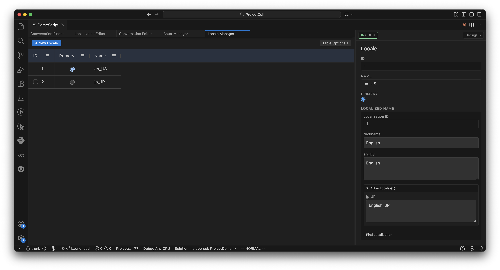

**Features:**
- **Create locales** – Add new languages (e.g., "English", "French", "Japanese")
- **Set primary locale** – The primary language used as the source for translations
- **Delete locales** – Removes all translations for that language (cannot delete primary)

### Inspector & Settings Panel

The Inspector panel (right side) shows context-sensitive properties for whatever you've selected.

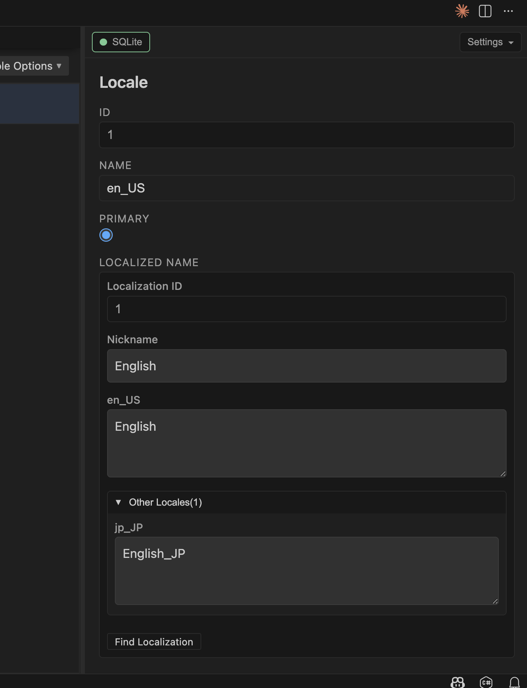

**Top bar buttons:**
- **Connection** – Database connection status and configuration
- **Settings** – Project-wide settings (snapshot path, code output folder, auto-export)

**Inspector content changes based on selection:**
- **Conversation** – Name, notes, tags, custom properties, localizations link
- **Node** – Type, actor, voice text, UI response text, condition/action code toggles, custom properties
- **Actor** – Name, color, notes, localized name
- **Locale** – Name
- **Tag Category** – Name, list of values (add/edit/delete)
- **Property Template** – Name, type, predefined values

**Settings panel:**

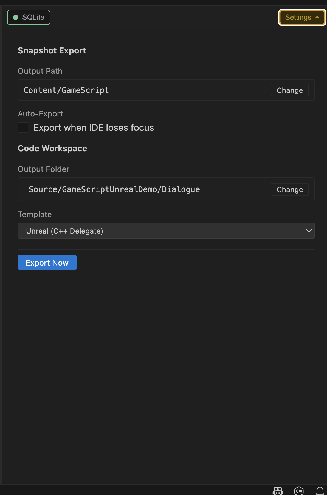

- **Snapshot Output Path** – Where to export `.gsb` binary files
- **Code Output Folder** – Where to generate condition/action code stubs
- **Code Template** – Target engine (Unity, Godot, Unreal)
- **Export Now** – Manually trigger snapshot export

### Localization Editor

The Localization Editor lets you edit all translatable text across your project.

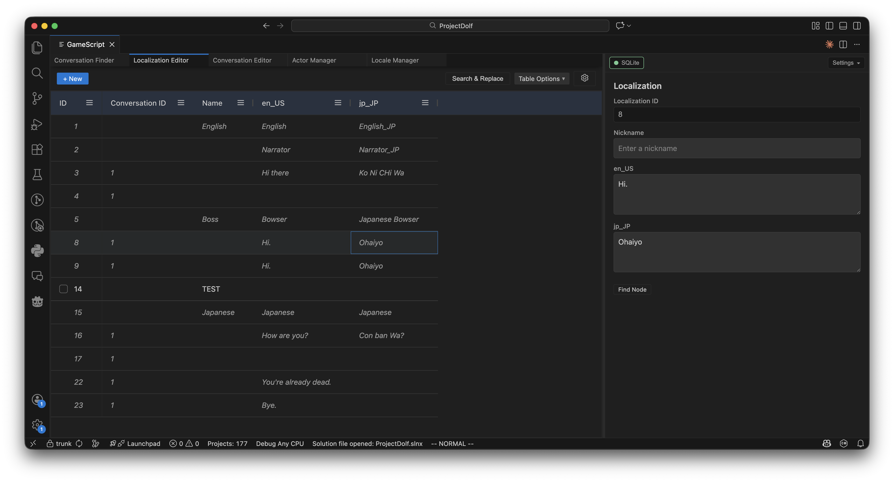

**Grid columns:**
- **ID** – Localization row identifier
- **Conversation** – Which conversation owns this text
- **Name** – Optional label for the localization
- **Locale columns** – One column per language containing the translated text
- **Tag columns** – Custom tag categories for organizing translations

**Features:**
- **Inline editing** – Click any cell to edit translations directly
- **Search & Replace** – Find and replace text across selected locales
- **CSV Export** – Download all translations for external editing
- **CSV Import** – Upload translations with validation and progress tracking

#### Localization Tag Categories

Similar to conversation tags, localization tags help organize your translations. Access tag settings via the gear icon in the Localization Editor toolbar.

**Example use cases:**
- "Voice Status" – Track which lines have been recorded
- "Review Status" – Mark translations as needing review
- "Context" – Categorize by in-game context (UI, cutscene, NPC dialogue)

## Features

- **Visual Graph Editor** - Node-based dialogue authoring with drag-and-drop
- **Multi-IDE Support** - VS Code and JetBrains Rider plugins
- **Native Code Integration** - Conditions and actions written in C#/C++/GDScript
- **Database-Backed** - PostgreSQL for teams, SQLite for individuals
- **Localization** - Built-in multi-language support with CSV export
- **Binary Snapshots** - FlatBuffers format for zero-copy runtime access
- **Hot Reload** - Automatic export on save, instant updates in-engine
- **Undo/Redo** - Full history with multiplayer resilience
- **Golden Layout UI** - Customizable panel arrangement

## Repository Structure

```
gamescript/
├── core/                       # Core schemas and generated code
│   ├── schema/                 # FlatBuffer schemas (.fbs)
│   └── generated/              # Auto-generated code
│       ├── ts/                 # TypeScript (UI, IDE plugins)
│       ├── csharp/             # C# (Unity, .NET IDEs)
│       └── cpp/                # C++ (Unreal)
│
├── shared/                     # Shared TypeScript package
│   └── src/                    # Types, query builders, utilities
│
├── ui/                         # Svelte web UI (graph editor)
│   ├── src/
│   │   ├── lib/
│   │   │   ├── api/            # Bridge to IDE plugins
│   │   │   ├── components/     # Svelte components
│   │   │   ├── db/             # Database abstraction layer
│   │   │   └── stores/         # Svelte stores
│   │   └── routes/             # SvelteKit routes
│   └── dist/                   # Built assets
│
├── plugins/
│   ├── vscode/                 # VS Code extension
│   │   └── src/
│   │       ├── database.ts     # SQLite/PostgreSQL connections
│   │       ├── panel.ts        # Webview panel management
│   │       └── handlers/       # Message handlers
│   ├── rider/                  # JetBrains Rider plugin (Kotlin)
│   │   └── src/main/kotlin/
│   └── dotnet/                 # Shared .NET code (future)
│
├── runtimes/
│   ├── unity/                  # Unity package
│   │   └── Packages/studio.shortsleeve.gamescript/
│   ├── csharp/                 # Shared C# runtime code
│   ├── godot/                  # Godot 4.x addon
│   │   ├── gdextension/        # C++ GDExtension source
│   │   └── project/addons/     # GDScript runtime
│   └── unreal/                 # Unreal Engine plugin
│       ├── Source/             # C++ runtime and editor modules
│       └── ThirdParty/         # FlatBuffers library
│
└── tools/                      # CLI tools (planned)
```

## Component Overview

### UI (`ui/`)

The web-based graph editor built with:
- **Svelte 5** - Reactive UI framework
- **SvelteKit** - Build tooling and routing
- **@xyflow/svelte** - Node graph visualization
- **Golden Layout** - Dockable panel system
- **ELK** - Automatic graph layout

The UI is embedded in IDE plugins via webview and communicates through a message bridge.

### Shared (`shared/`)

TypeScript package containing:
- Database schema types
- SQL query builders
- FlatBuffer type definitions
- Shared utilities

### VS Code Plugin (`plugins/vscode/`)

Extension providing:
- Webview panel hosting the UI
- SQLite and PostgreSQL database connections
- File system access for code generation
- Binary snapshot export

### Rider Plugin (`plugins/rider/`)

Kotlin-based plugin for JetBrains Rider:
- JCEF browser hosting the UI
- Same database and file system capabilities as VS Code
- Native IDE integration

### Unity Runtime (`runtimes/unity/`)

Unity package providing:
- FlatBuffer snapshot loading
- Dialogue state machine
- Attribute-based function binding
- Editor tooling

### Godot Runtime (`runtimes/godot/`)

Godot 4.x addon providing:
- C++ GDExtension for FlatBuffer parsing
- GDScript dialogue execution engine
- Custom Inspector plugins for ID types
- Export validation

### Unreal Runtime (`runtimes/unreal/`)

Unreal Engine plugin providing:
- FlatBuffer snapshot loading
- Dialogue state machine with UGameplayTask support
- Macro-based function binding (NODE_CONDITION/NODE_ACTION)
- Custom property drawers and picker windows
- Pre-PIE build validation
- IPC integration with GameScript IDE

## Runtime Installation

### Unity

Install via the Unity Package Manager using a Git URL:

1. Open **Window > Package Manager**
2. Click the **+** button and select **Add package from git URL...**
3. Enter:
   ```
   https://github.com/ShortSleeveStudio/GameScript.git?path=/runtimes/unity/Packages/studio.shortsleeve.gamescript#vX.Y.Z
   ```
   Replace `vX.Y.Z` with the desired version tag (e.g., `v2.0.10`).

### Godot

Godot does not have a built-in package manager with Git URL support. Install manually:

1. Download the release ZIP from the [Releases page](https://github.com/ShortSleeveStudio/GameScript/releases)
2. Extract the `addons/gamescript/` folder
3. Copy it to your project's `res://addons/` directory
4. Enable the plugin in **Project > Project Settings > Plugins**

Alternatively, clone the repository and copy `runtimes/godot/project/addons/gamescript/` to your project.

### Unreal Engine

Unreal does not support Git URL installation for plugins. Install manually:

1. Download the release ZIP from the [Releases page](https://github.com/ShortSleeveStudio/GameScript/releases)
2. Extract the plugin folder
3. Copy it to your project's `Plugins/GameScript/` directory (create `Plugins/` if it doesn't exist)
4. Regenerate project files (right-click `.uproject` → **Generate Visual Studio project files**)
5. Enable the plugin in **Edit → Plugins**, search for "GameScript"
6. Restart the editor when prompted

Alternatively, build from source:
```bash
cd runtimes/unreal
./setup_flatbuffers.sh  # Fetch FlatBuffers dependency
./build.sh              # Build plugin to Build/ directory
# Then copy Build/ to your project's Plugins/GameScript/
```

See [runtimes/unreal/INSTALLATION.md](runtimes/unreal/INSTALLATION.md) for detailed installation and usage instructions, including **VSCode IntelliSense setup** for the code preview feature.

## Prerequisites

- **Node.js** 18+
- **pnpm** 8+
- **JDK** 17+ (for Rider plugin)

## Getting Started

### Install Dependencies

```bash
pnpm install
```

### Build Everything

```bash
pnpm build
```

Builds in dependency order:
1. `shared/` - TypeScript utilities
2. `ui/` - Svelte web UI
3. `plugins/vscode/` - VS Code extension

### Development Mode

```bash
pnpm dev
```

Runs all packages in watch mode with hot reload.

### Build Rider Plugin

```bash
pnpm build:rider
```

Or manually:
```bash
cd plugins/rider
./gradlew buildPlugin
```

The built plugin ZIP will be in `plugins/rider/build/distributions/`.

## Testing

### Run All Tests

```bash
pnpm test
```

### Test Individual Packages

```bash
# UI tests
pnpm --filter @gamescript/ui test

# Shared package tests
pnpm --filter @gamescript/shared test
```

### Testing VS Code Extension

1. Open the repository root in VS Code
2. Run `pnpm build`
3. Press **F5** to launch Extension Development Host
4. Click the GameScript icon in the Activity Bar

### Testing Rider Plugin

```bash
pnpm dev:rider
```

This builds the UI and launches a sandboxed Rider instance with the plugin.

## Packaging

### VS Code Extension

```bash
pnpm package:vscode
```

Creates `.vsix` file in `plugins/vscode/`.

### Rider Plugin

```bash
pnpm package:rider
```

Creates plugin ZIP in `plugins/rider/build/distributions/`.

## Available Scripts

| Command | Description |
|---------|-------------|
| `pnpm install` | Install all dependencies |
| `pnpm build` | Build all packages |
| `pnpm build:rider` | Build Rider plugin |
| `pnpm dev` | Run all packages in watch mode |
| `pnpm dev:rider` | Build UI and run Rider sandbox |
| `pnpm test` | Run all tests |
| `pnpm lint` | Run linters |
| `pnpm format` | Format code with Prettier |
| `pnpm clean` | Remove build artifacts |
| `pnpm package:vscode` | Package VS Code extension |
| `pnpm package:rider` | Package Rider plugin |

## Architecture

### Data Flow

```
┌─────────────┐     ┌──────────────┐     ┌─────────────┐
│  Graph UI   │ ──▶ │   Database   │ ──▶ │  .gsb File  │
│  (Svelte)   │     │ (SQL/Postgres)│     │ (FlatBuffer)│
└─────────────┘     └──────────────┘     └─────────────┘
       │                                        │
       │ Messages                               │ Load
       ▼                                        ▼
┌─────────────┐                          ┌─────────────┐
│ IDE Plugin  │                          │   Engine    │
│(VSCode/Rider)│                          │   Runtime   │
└─────────────┘                          └─────────────┘
```

### Native Code Integration

Actions and conditions are written in native code with attribute markers:

```csharp
// Unity C# example
[NodeCondition(456)]
public static bool HasEnoughGold(IDialogueContext ctx)
{
    return GameState.PlayerGold >= 10;
}

[NodeAction(456)]
public static async Awaitable HandOverGold(IDialogueContext ctx, CancellationToken token)
{
    GameState.PlayerGold -= 10;
    await AnimationManager.Play("hand_over_gold", token);
}
```

```cpp
// Unreal C++ example
NODE_CONDITION(456)
bool HasEnoughGold(const IDialogueContext* Context)
{
    return GameState->PlayerGold >= 10;
}

NODE_ACTION(456)
UGameplayTask* HandOverGold(const IDialogueContext* Context)
{
    GameState->PlayerGold -= 10;
    return UDialogueAction_PlayAnim::CreateTask(Context, HandOverGoldAnim);
}
```

At runtime, the engine builds jump tables for O(1) function dispatch.

### Database

- **SQLite** - Single-user, file-based, no setup required
- **PostgreSQL** - Multi-user, real-time collaboration via LISTEN/NOTIFY

Both support the same schema and UI. Switch between them in the connection panel.

### Binary Snapshots

Export format uses FlatBuffers for:
- Zero-copy memory mapping
- O(1) random access
- Minimal memory footprint
- Per-locale bundles

## Troubleshooting

### Rider Plugin: Slow/Jerky Scrolling

If you experience slow or jerky scrolling in the Rider plugin, disable out-of-process JCEF:

1. Go to **Help → Find Action** (or press `Ctrl+Shift+A` / `Cmd+Shift+A`)
2. Search for "Registry..."
3. Find `ide.browser.jcef.out-of-process.enabled`
4. Uncheck it
5. Restart Rider

## Versioning

See [VERSIONING.md](VERSIONING.md) for the list of files that need version bumps.

## Architecture Details

- [ARCHITECTURE.md](ARCHITECTURE.md) - Overall system architecture
- [ARCHITECTURE_UNITY.md](ARCHITECTURE_UNITY.md) - Unity runtime details
- [ARCHITECTURE_GODOT.md](ARCHITECTURE_GODOT.md) - Godot runtime details
- [ARCHITECTURE_UNREAL.md](ARCHITECTURE_UNREAL.md) - Unreal runtime details

## License

See [LICENSE.md](LICENSE.md).
